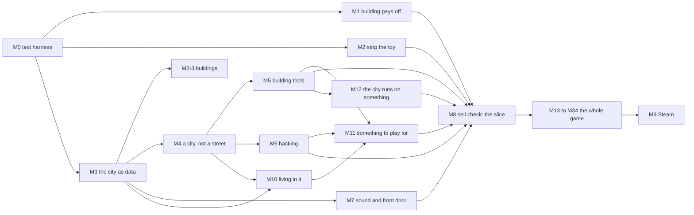

# Urbis plan

Owner: Claude, game director. Written 2026-10-03 at the operator's request, on top of
the design docs, not instead of them. Any change to a milestone's acceptance criteria
or its order needs the operator's yes. Every worker reads this before
`docs/plan/TASKS.md`, `docs/plan/milestones/`, `docs/handoff/` or `docs/tasks/`.

This file says **what** gets built, in what order, and how each piece is proven done.
`docs/plan/TASKS.md` says **how** for M0 to M12: every task, its files, what it needs
first, and its check. M13 to M34 are one file each in `docs/plan/milestones/`, with their
criteria and tasks together. Everything Cities: Skylines, GTA, Watch Dogs and Cyberpunk
2077 have is in one of them (D15).

## The game, and where each part of it comes from

**Build a city, then live in it** (`AGENTS.md`). It borrows one thing from each of four
games: Cities: Skylines' building, GTA's freedom on foot and in cars, Cyberpunk 2077's
depth (characters, choices, interiors; never the look), and Watch Dogs' hacking **as one
toolset among several**. The long game is **poke it and watch**: the city never ends,
and every tool sets off a chain the player can watch spread, sized to the act.

The operator's decisions this plan answers to:

| Date | The operator said | Recorded in |
|---|---|---|
| 2026-09-19 | The game "looks nothing like a city, a suburb or outskirt, or river, bridge, mountain, terrain, underpass, overpass, subways"; to pay for it, "just do what Watch Dogs can" | `docs/superpowers/specs/2026-09-19-world-scale-design.md` |
| 2026-09-28 | A grounded modern city, no neon; Cyberpunk is depth, not look; build it, then enter it, then pressure and story | `docs/CHARTER.md` |
| 2026-09-29 | It "looks like a lego game more than Watch Dogs or GTA", and that means "pretty much everything" | VGA-084 in `docs/VISUAL-GAP-ACTIONS.md` |
| 2026-10-02 | Every new game generates a new city | `AGENTS.md`, `docs/PROCGEN.md` |
| 2026-10-02 | The hook is poke it and watch; the city never ends; sell it if it is good; the worry is that it never gets finished | this file |
| 2026-10-03 | No budget for Claude; the work goes to OpenCode; DeepSeek sweeps the game for defects; every milestone has acceptance criteria | this file |
| 2026-10-03 | Building tools on the scale of Cities: Skylines: roads, services, a city budget | this file (M5) |
| 2026-10-03 | The work runs on this MacBook; an agent should make the models; "Watch Dogs can do much more" than two new hacks; nothing is committed or started until the plan is settled | this file (M2, M6) |
| 2026-10-03 | Every building can be deleted; the plan needs "a lot more serious planning and detail" | this file (M3, M5), `docs/plan/TASKS.md` |
| 2026-10-03 | "Ask yourself which one should build first": build order is the director's call | this file (D1, D2) |
| 2026-10-03 | "Are you sure you cover all capabilities from Cities: Skylines + Watch Dogs + GTA + Cyberpunk?" | `docs/plan/CAPABILITIES.md`; this file (M5, M10, M11, D9, D10) |
| 2026-10-03 | The operator had OpenCode audit the plan, three rounds, 72 findings, each checked against the code | this file (M2-3, M2-6, M6-3, M7-7, M7-8, M9-6, D11, rule on numbers, one key one meaning); `docs/plan/TASKS.md` |

## What is built and what is missing, 2026-10-03

| Part | Built | Missing |
|---|---|---|
| **Building** (Skylines) | Z city view, brushes R C I X, click any of the generated lots (`CITYVIEW.md`); X clears a lot's building, a stage every 15 s; lots grow EMPTY → HIGH and decline with a reason (`ZONING.md`); a district economy of jobs, homes, wealth and firms (`ECONOMY.md`); the news line | **No building tools beyond repainting lots:** only the 16-28 lots can be cleared; the row buildings between them and the pinned towers are fixed geometry and cannot be deleted. No roads, services, transit or budget. **And building does not pay off.** `ECONOMY-PROBE.md`: rezoning both free lots for works adds **0 homes** at 2, 5 and 10 minutes; a zoned lot's first floor takes **113 s** (median) and never comes on seed 2; demand sits pinned **45-62%** of the time |
| **Living in it** (GTA) | Walk, drive, a 12-minute day, residents with homes and jobs, save and continue; police ★ to ★★★ with cruisers, spike strips, roadblock, helicopter, search ring and dispatch subtitles (`WANTED.md`) | Traffic and walkers are a loop, not a city (below). Toy cars and people; **no sound at all**. Only the hero car can be driven; no sprint, minimap or waypoint; walkers never react; cars take no damage (`docs/plan/CAPABILITIES.md`) |
| **Depth** (Cyberpunk) | A six-mission arc, three people with attitudes, two choices that change the street, a journal (`ARC.md`); the noodle bar, a roof, and a room behind every grown lot's door (`INTERIORS.md`); the profiler | The next nine interiors (`BACKLOG.md`); the radio, deferred until there is audio. The ₡ the arc pays shows on the HUD and buys nothing; no side jobs; no progression |
| **Hacking** (Watch Dogs) | The blackout cascade (H), and its economic aftermath | **One hack.** "One toolset among several" is not true yet |
| **The world** | A city generated from each seed: named streets, lots, farmland and mountains past the edge | One district, 2-4 avenues of 200 m. No river or bridges, no suburb, no hills, no overpass or subway |
| **The front door** | Save and continue | No audio system, no title screen, pause or settings, no accessibility. Steam scaffolding from the old code (`electron.cjs`, `greenworks.json`); `steam_appid.txt` holds **480, Valve's test app**, not a real id |
| **The look** | No neon (VGA-083); no two buildings overlap (VGA-084.1); mountains are slopes | VGA-084.3 to .6: box cars (the hero car is still a slab, D16), primitive people, icosahedron trees, `box()` street kit and interiors. VGA-084.2's generated street wall, six facade materials, rooflines and cornices are built; window reveals are not. 10 open defects in `docs/shots/REVIEW.md`, and the game has never been swept for the rest |

**The scorecard is retired as a measure of progress.** It showed 36 green cells while
building did not pay off: its "walk in" bot calls `enterLot()`, a teleport; its hack
check passes when a flag flips; its code row passes with 12 functions over the 60-line
hard limit. `npm run scorecard` stays as a boot check. Progress is the acceptance
criteria below and nothing else.

**Measured on this Mac, 2026-10-03** (M3 GPU through ANGLE Metal, 1280 × 720, the
spawn pose, seeds 7, 11, 22, 33 and 73; scripts kept in the session notes, rebuilt as
M0's tools):

| What | Today |
|---|---|
| Draws | 134-137 by day, 122-125 at night, of 175. By day: 101 main, 21 shadow, 15 post-processing |
| Where the draws go | The street wall 21 (12 + 9 shadow); walkers 12 (11 + 1); traffic and parked cars 11 (10 + 1); the hero car about 9; the ground 8; the outskirts 10 |
| Frame time | 16.7 ms median (the 60 Hz cap); 95th percentile **16.8-17.6 ms**, so 60 fps is already missed now and then |
| Triangles | 1.14 M a frame (the HUD's count). The hydrant model alone is 86 k triangles in a 1.9 MB file, drawn at 5 places, so street props are a large share |
| Sim step | 0.01 ms mean, 0.78 ms worst, for 16-25 lots, 68-337 people, 72 walkers, 35-51 cars |
| Save | 3.8 KB (hand preset: 10 lots, 22 people) |
| Deleting buildings | In the city view, X clicked over every 30 px of the screen (seed 7): all 15 lots came down; **every row building and both towers still stood** |

## Why the order is what it is: the city is a stage set, not a model

Skylines' tools change the city: a road, a demolition, a fire station. Today the city
cannot be changed, because almost none of it exists as data the game can edit. Read
from the code on 2026-10-03:

1. **Roads are fixed when the page loads.** `DISTRICTS`, `EDGES` and `NODES` are module
   constants (`src/sim/world.js:52`, `:104`), and 17 more load-time constants hang off
   them: `AVENUES`, `CROSSINGS`, `WORLD_PLAN`, `PINNED_TOWERS`, `WORLD_FURNITURE`,
   `WORLD_VISTAS`, `WORLD_DRESSING`, `MIDBLOCK`, `SUBSTATIONS`, `SPAWN` and others (the
   full list is in `docs/plan/TASKS.md`, M3), read by about 30 files.
2. **Only the lots are buildings the game knows about.** The row buildings between the
   lots are made in the renderer (`src/render/block.js:314`, `streetWall`), from the
   same seed, 2084, in every city, and styled by the hand map's coordinates
   (`block.js:307`: `ax === 0 && z < 40` is the old plaza). They and the pinned towers
   are merged into one mesh per material. The economy does not count them: a district's
   size is a guess, lot area times 0.4 (`src/sim/economy.js:19`).
3. **Traffic and walkers are a loop.** 16 cars and 72 walkers move in a straight line
   and jump back to the start at the end of an avenue (`src/sim/street.js:266`).
   Commuters only turn round to face their goal. Only the police find routes over the
   road graph (`src/sim/patrol.js:68`).
4. **Districts are two halves.** Power and economy split at z = 0 (`street.js:201`,
   `zoneAt`); the economy's districts are named `south` and `north`
   (`economy.js:9`); window lighting is baked for exactly two zones.
5. **The sim steps by frame time** (`src/main.js:1024`), so two runs in the browser
   never match. Only the Node probe is exact.
6. **`src/main.js` is 1,269 lines** that every lane edits, so parallel lanes collide.

So roads, bulldozing, services, more districts, and hacks on signals, bollards and
cars all need the same foundation: **the city as data the game can change, with
traffic that drives it.** Built on the stage set, each would be torn out later. M3
lays that foundation **one task at a time with the game playable and the gate green
after every task**, not as a rewrite in a branch. Two patterns already in the code
show the way: grown lots are instanced shells (`src/render/zoning.js`), and the
outskirts stream through fixed-size instance pools at a flat 9 draws however many
tiles are loaded (`src/render/outskirts.js`). M3 draws every building and road that way.

## Order, lanes and what waits for what

| Milestone | Needs first | Lane | Tasks |
|---|---|---|---|
| M0 The test harness | nothing | tools | 10 |
| M1 Building pays off | M0-4 (A/B runner), M0-3 (real input) | sim | 6 |
| M2 Strip the toy | M0-5 (sweep); M2-3 also needs M3-5 | assets | 17 |
| M3 The city as data | M0 | engine (sim and render) | 41, plus 2 spikes |
| M4 A city, not a street | M3 | engine | 18 |
| M5 The building toolset | M4 | sim, UI | 36 |
| M6 The hacking toolset | M4; the fire-alarm hack also needs M5-5 | sim, render | 23 |
| M7 Sound and the front door | M3-1 (main.js split) | front door | 19 |
| M10 Living in it | M3-6 (routed traffic); the water criterion waits for M4-2 | street | 22 |
| M11 Something to play for | M5, M6 and M10 (its gigs use their tools); the gig board can start after M4 | depth | 15 |
| M12 The city runs on something | M5 | city | 14 |
| M8 The sell check: the vertical slice | M1, M2, M5, M6, M7, M10, M11, M12 | operator | 4 |
| M13 Combat | M8-2; tasks named in M19, M23, M24 | combat | 55 |
| M14 The whole city builder | M8-2; tasks named in M15, M16 | city | 43 |
| M15 Every city service | M8-2; tasks named in M13, M14, M26, M27 | city | 35 |
| M16 Transport | M8-2; tasks named in M13, M14 | city | 29 |
| M17 On foot | M8-2; tasks named in M13, M18, M27, M33 | street | 19 |
| M18 Every vehicle | M8-2; tasks named in M13, M16, M17, M21, M24, M27 | street | 36 |
| M19 Police, crime and gangs | M8-2; tasks named in M13, M15, M18, M21, M27, M33 | street | 19 |
| M20 All of hacking | M8-2; tasks named in M13, M15, M16, M19, M21, M33 | hack | 22 |
| M21 People, friends and the crew | M8-2; tasks named in M13, M15, M19, M20, M25, M27 | street | 23 |
| M22 Money, shops and business | M8-2; tasks named in M13, M15, M16, M23, M24, M27, M33 | city | 16 |
| M23 Progression | M8-2; tasks named in M13, M17, M19, M21, M24, M25 | street | 17 |
| M24 The story, missions and things to do | M8-2; tasks named in M14, M18, M19, M20, M21, M26, M27, M33 | story | 28 |
| M25 The character, clothes, gear and inventory | M8-2; tasks named in M20, M21, M22, M23, M24, M33 | street | 21 |
| M26 Weather, seasons, land and animals | M8-2; tasks named in M13, M14, M15, M17, M27 | city | 16 |
| M27 The phone, the screens and the interface | M8-2; tasks named in M14, M20 | street | 19 |
| M28 Radio, music, voices and sound | M8-2; tasks named in M24, M27 | front door | 11 |
| M29 Settings, accessibility, saves and platforms | M8-2; tasks named in M9, M13, M27 | front door | 18 |
| M30 Online | M8-2; tasks named in M9, M13, M20, M22, M24, M25, M29 | online | 30 |
| M31 Editors, mods and director mode | M8-2; tasks named in M9, M14, M26, M27 | tools | 14 |
| M32 Cheats | M8-2; tasks named in M13, M17, M29 | street | 4 |
| M33 The city's places, people, story and packs | M8-2; tasks named in M16, M21, M23, M24, M25, M26, M29 | story | 16 |
| M34 The look, finished | M8-2; tasks named in M18, M19, M20, M25, M26, M27, M33 | look | 18 |
| M9 Ship on Steam | M13 to M34; M9.T2, M9.T4, M9.T7 and M9.T8 run ahead once M8-2 says sell | ship | 9 |

**The long pole is M0 → M3 → M4 → M5 and M6 → M11 → M8**, then **M13 → M22 → M25 → M21 →
M24 → M33** (weapons, shops, clothes, playing as one of the crew, the acts, the set
pieces: 19 tasks deep), then M9. M1, M2, M7, M10 and M12 run beside the first half. A
milestone's number is its name, not its place in the order: M10 to M12 were added after
M9 and come before M8, and M13 to M34 come after M8 and before M9.

M0 to M12 are the **vertical slice**: every leg of the game, its first 20 minutes, built
to ship quality (D10). Nothing in M13 to M34 starts before M8-2 says sell. After that
they overlap: a task there waits only for the exact tasks its Needs names, never a whole
milestone, so "Needs first" above lists whose tasks it uses, and two milestones may each
use some of the other's.

At most **four lanes run at once**: Claude reviews every merge, and a fifth lane only
queues at review. 745 tasks in all: 236 for M0 to M12 in `docs/plan/TASKS.md` and 509
for M13 to M34 in `docs/plan/milestones/`. Every task is written out now; tasks after M3
are re-checked against the spikes' findings when M3 is half done, and any change to them
is logged there.

*Operator, optional:* a 10-minute play after M1 and M2 close. Does zoning pay off, and
does it stop looking like a toy? Not a sell decision, a direction check.

## Who does what

OpenCode costs next to nothing ($15.58 in total over 210 days); Claude is the expensive
one. Claude does only what a cheap model cannot do well.

- **DeepSeek v4.1 flash at max effort** builds every feature, **writes the check for
  every acceptance criterion**, runs the checks, and runs the defect sweeps.
- **GLM 5.3 flash** takes what DeepSeek gets stuck on, and judges screenshots where a
  criterion asks for a second pair of eyes.
- **Claude** writes the acceptance criteria (this file) and the tasks
  (`docs/plan/TASKS.md`), reads the evidence each criterion points to, spot-checks 5
  shots per sweep, and merges. Claude does not write game code and does not run long
  probes.
- **The operator** makes the decisions in "Decisions the operator owns" below, and
  nothing else is asked of them.

## Rules for an acceptance criterion

1. **Pass/fail, with a number.** "Looks better" is not a criterion.
2. **One check proves it:** a test file or script named in the table, which anyone can
   run. Its evidence (shots, numbers) is written to a named path.
3. **Real input only.** The check presses the keys, clicks the mouse and walks with
   WASD as a player would. Teleporting or fast-forwarding may set up the start, never do
   the act under test. Running the fixed-step sim faster (`?speed=4`, M0-2) is not
   fast-forwarding: every step still runs.
4. **Seen failing once.** The check lands before the fix and is run on main first. If
   main is already broken, the check must be red there; if main already passes, the
   worker unwires one line, shows it red, and says so in the commit. A check never seen
   red proves nothing.
5. **"The city reacted" means A/B.** The same seed runs twice from the same start: A
   is poked, B is left alone. The criterion compares A to B, never A to itself.
6. **The defect sweep** (`scripts/sweep.mjs`, M0-5) runs a fixed list of poses on seeds
   7, 11, 22, 33 and 73 and logs every defect in `REVIEW.md` with the shot, the pixel
   and what `__game.pick()` names there, answering the questions in `AGENTS.md` step 5.
   Claude spot-checks 5 shots; any defect the sweep missed becomes a new line in its
   checklist.
7. **A criterion is green** only with its commit hash and evidence path in the Done log.
8. **"Today"** is measured or marked unknown. Unknowns are set by the first check run.
9. **Green stays green.** A milestone closes only when `npm run accept` (M0-6) passes
   every criterion already in the Done log, its own and every earlier milestone's.

Every milestone also carries two standing criteria: `npm run gate` is green, and draws
stay at or under 175 on every frame of that milestone's pose sweep, read on every
`requestAnimationFrame`. "Five seeds" always means 7, 11, 22, 33 and 73, generated.

10. **A number has a basis.** It is measured (the Today column), derived (the row
   says from what), or a feel value. Durations, distances and speeds in M5-M11 are feel
   values unless the row says otherwise, and their task may tune them, with the reason
   in its commit. An effect size in an A/B criterion that nothing has measured yet is
   marked *(provisional)*: the task that writes its check sets it from B's measured
   spread over the five seeds, so a pass is larger than the noise between seeds.

## M0 — The test harness

**Why first:** every criterion below names a check. Without shared tools, each check
reinvents key presses, A/B runs and screenshots, and cheap models write fragile ones.
And a browser run cannot be compared with another until the sim steps by a fixed clock.

| ID | Pass when | Checked by | Today |
|---|---|---|---|
| M0-1 | **Fixed step:** the sim advances in 50 ms steps in the browser, and the renderer interpolates between them. An input log recorded with `?record=1` and replayed with `?replay=` on the same seed gives the same `__game.stateHash()` at 60 game seconds in 3 runs of 3 | `tests/accept/m0-replay.spec.js` | red: frame time (`main.js:1024`) |
| M0-2 | `?speed=4` runs 4 sim steps per frame; a replay at speed 4 ends with the same state hash as at speed 1 | same file | red |
| M0-3 | **Real input:** shared helpers hold keys for game seconds, click a world point (projected to the canvas by `__game.screenOf()`), and open the city view and pick a brush; an example check zones a lot by mouse with them | `tests/accept/lib/input.js`; `tests/accept/m0-input.spec.js` | red |
| M0-4 | **A/B runner:** boots the pure sim in Node from a seed with `main.js`'s tick order, pokes A at a set time, steps both, and returns per-district differences; `scripts/economy-probe.mjs` runs on it and prints the same tables as before | `tests/accept/lib/ab.js`; the probe's output | partial: the probe has its own loop |
| M0-5 | **The sweep:** `node scripts/sweep.mjs --poses <file>` shoots every pose on the five seeds, writes a `__game.pick()` report per shot and a draft `REVIEW.md` section, in under 10 minutes | `scripts/sweep.mjs` | red |
| M0-6 | `npm run accept -- M1` runs one milestone's checks; `npm run accept` runs every criterion in the Done log | `package.json` | red |
| M0-7 | **Golden maps:** per seed, a JSON of every road, building footprint, lot, lamp, sign and story place; a test fails on any change the commit does not declare | `scripts/map-golden.mjs`; `tests/golden/` | red |
| M0-8 | **Shot diff:** two shot folders in, the share of pixels that differ per pose out | `scripts/shotdiff.mjs` | red |
| M0-9 | **Smooth at any step:** every moving thing drawn (the player, cars, walkers, police, the helicopter) is drawn between its last two sim steps; over 300 frames at 60 fps, nothing whose sim speed is above 0 holds the same screen position for two frames running | `tests/accept/m0-smooth.spec.js` | red: the fixed step is not built; once it is, only the player, car and camera would be drawn between steps |

## M1 — Building pays off, and nothing on screen is broken

From: CHARTER feature slices 1-2, `ECONOMY-PROBE.md`. **Question:** when I zone
something, can I see the city answer?

| ID | Pass when | Checked by | Today |
|---|---|---|---|
| M1-1 | On all five seeds: Z, the R brush, click an empty lot with the mouse, Z again. Within **60 game seconds** the lot has its first floor, and a play-camera shot shows it | `tests/accept/m1-zone-shows.spec.js`; `docs/shots/m1-zone-<seed>-before/after.png` | red: 113 s median, never on seed 2 |
| M1-2 | A/B over 5 game minutes: A zones the district's 2 free lots for works, B touches nothing. A finishes **at least 1 more storey of flats** in that district than B, on **4 of 5** seeds | `tests/accept/m1-rezone-ab.test.js` (Node, M0-4) | red: +0 homes |
| M1-3 | On every seed where M1-2 passes, A's news line names the rezone as the cause ("…for the new workshops") within 5 game minutes; B never shows that line | same file as M1-2 | red: line shelved |
| M1-4 | Left alone for 10 game minutes, no district's demand for any use sits pinned (≥ `BREAK_GROUND_AT`) or idle (< `DECLINE_AT`) for more than **40%** of samples *(provisional)*, on all five seeds | `tests/accept/m1-calm.test.js` (thresholds from `scripts/economy-probe.mjs`) | red: pinned 45-62% |
| M1-5 | A/B: the player walks to the lit district and presses H. The dark district loses at least 10% of its jobs against B within 5 game minutes; the other district stays **bit-identical** | `tests/accept/m1-hack-ab.spec.js` | green on the probe (−64 jobs at 5 min); keep as a guard |
| M1-6 | The sweep of the first 2 minutes (spawn, four headings, day and night, the city view, five seeds: 50 shots) has **0 open defects** other than raw-primitive models, which M2 owns | the sweep; `docs/shots/m1-sweep-*` | red: D3, D4 sit at spawn; the HUD panels overlap each other's text in the city view (seed 7) |

**How:** "M1 detail" below. **If M1-2 is still red after it:** simplify the market:
what you zone is what grows, and demand only sets how fast. *Operator* says yes or no
to that, since it changes the game. M3 later changes how a district is counted (every
building, not lot area times 0.4); M1's checks then guard that change (rule 9).

## M2 — Strip the toy (VGA-084, sub-slices 2 to 6)

From: the operator, 2026-09-29. The order and the done-when are VGA-084's own. Cars,
people, trees and street kit do not depend on the city layout, so they start now beside
M1. **Buildings (M2-3) wait for M3-5**, when every building becomes an instance drawn
from a kit. The six facade materials, rooflines and cornices already built move into
the pools with the buildings (M3.T22-T25); M2-3 adds the rest of the kit.

**Where the models come from: made by an agent, on this Mac** (MacBook Air M3, 16 GB
memory, 57.0 GB free disk measured 2026-10-06, after the trellis2mlx fallback was
deleted). Researched 2026-10-03, settled 2026-10-06 by M2.E1:

- **Image to 3D runs on this Mac.** `ASSETS.md`'s tools are CUDA-only, but community
  Apple-Silicon ports exist. **The pipeline is
  [trellis.cpp](https://github.com/pwilkin/trellis.cpp)** (pwilkin's C++/GGML port of
  TRELLIS.2, MIT): built from source, **9.3 GB** of ungated Q8 GGUF weights (DINOv3
  comes from the same mirror, so nothing waits on a Hugging Face access request),
  natively Metal, no Python at runtime. M2.E1 measured one car end to end on this Mac:
  **16 min 35 s wall, 2.81 GB peak RSS**, a 5.3 MB GLB
  (`tools/models/README.md`, `tools/models/evidence/`). The alternative,
  [trellis2mlx](https://github.com/lyonsno/trellis2mlx) (Microsoft's TRELLIS.2 in
  Apple's MLX), was installed and measured — **18.1 GB** of weights, 6.75 GB peak on a
  16 GB M2 Pro, about 21 minutes a model — but it is blocked on gated DINOv3 and has
  never produced an image-conditioned model here; the operator deleted it on
  2026-10-06 to free 18.8 GB, and re-installing needs gated DINOv3 access. The
  original TRELLIS.2 is not used, because its NVIDIA renderer (`nvdiffrast`) is
  non-commercial.
- **Not used:** the Hunyuan3D 2.1 Mac ports. They work in 16 GB, but Tencent's licence
  excludes the EU, the UK and South Korea, outputs included, which matters for a game
  sold worldwide. The trellis-mac PyTorch port wants 24 GB.
- **Where each kind of model comes from:**
  - **Cars, street kit, props, police kit:** a reference image goes through
    trellis.cpp (`tools/models/trellis_cpp.sh`), then a Blender script made by DeepSeek
    cuts it to a game budget, sets metres, Y-up and the origin at the base
    (`ASSETS.md` rule 5), and exports the GLB. A model that comes out wrong is made
    directly as a Blender script instead.
  - **People:** generated meshes come out as one fused statue with no skeleton, which
    cannot walk. So **MPFB**, MakeHuman's Blender add-on, builds the bodies (realistic,
    rigged, output CC0), and the walk comes from the CMU motion-capture library (free
    for any use), fitted in Blender.
  - **Buildings** stay generated in code, because every city is new (`AGENTS.md`).
    Their parts (cornices, window frames, roof plant, shopfronts) are models made
    either way, drawn as instance pools (M3-5).
  - **Materials:** Poly Haven and ambientCG (CC0), as now.
- **Reference images:** photos of real cars and branded things are not used, so no
  trademark gets into the game. Images come from CC0 sources or from a text-to-image
  model; which one runs on this Mac is part of M2-0.
- **Disk:** the trellis.cpp route costs **9.6 GB** (9.3 GB Q8 weights plus a 46 MB
  native build); the trellis2mlx stack — Python env 0.8 GB and weights 18.1 GB — was
  deleted on 2026-10-06 to free **18.8 GB**. Blender (0.9 GB) stays, and the tools'
  Python is a 161 MB `tools-venv` (numpy, pillow, scipy) for the reference cut and the
  renders. M2-0 and M2.E1 measured both stacks (2026-10-06,
  `tools/models/README.md`); the machine had 68.5 GB free before the installs, not the
  16 GB this section first assumed.
- **People cost draws.** 72 walkers as separate rigged meshes would be 72 draws of the
  175. So only the player is a rigged mesh; the walkers' walk is baked into a texture
  that one instanced pool plays, at most 2 draws for all of them.
- **The game has three model files today** (`public/assets/models/`: hydrant, bin,
  street lamp), and one GLB loader (`src/render/props.js`). M2-0 also proves the loading
  path: a skinned, animated GLB has never been in the game.

| ID | Pass when | Checked by | Today |
|---|---|---|---|
| M2-0 | **The pipeline works on this Mac before anything depends on it:** one car through trellis.cpp and one walking MPFB person, each produced by a script in `tools/models/` that DeepSeek runs, load in the game; a play-camera shot of each has no defect in the sweep; the README records minutes per model, peak memory and disk used | `tools/models/README.md`; `docs/shots/m2-0-car.png`, `m2-0-person.png` | partial: the car is made and measured (M2.E1 — 16 min 35 s, 2.81 GB peak, 5.3 MB GLB, `tools/models/README.md`); nothing is loaded in the game yet; the person is not started |
| M2-1 | **Cars:** the hero car, traffic and police cruisers render from model files listed in `public/assets/CREDITS.md`; no box geometry in any car body; traffic and parked cars together at most 11 draws (today's), the hero car at most 9 | `tests/accept/m2-cars.spec.js` | red: traffic re-bodied, hero car still a slab (D16), cruisers are kit primitives |
| M2-2 | **People:** the player is a rigged model; pedestrians are one instanced pool with a baked walk (a vertex animation texture), **at most 2 draws for every walker**; the limbs of both move between frames while they walk | `tests/accept/m2-people.spec.js` | red: "a person" of parts (`7d6d599`); walkers cost 12 draws |
| M2-3 | **Buildings** (after M3-5): on all five seeds, every facade has window reveals at least 0.15 m deep, at least 3 facade materials appear, and frontage stays at or above `check:overlap`'s ratchet (98.2%); the kit's pooled parts (frames, shopfronts, roof plant) cost no more than 12 draws | `tests/accept/m2-streetwall.spec.js`; `npm run check:overlap` | red: no window reveals. Built: six facade materials (`render/block.js:476-486`), rooflines and cornices (`05daf90`), a seed-derived street wall (`c9260f8`); frontage 98.3% worst row on the hand map; generated seeds not measured |
| M2-4 | **Landscape:** trees render from a model; no icosahedron or cone in any tree or mountain | `tests/accept/m2-landscape.spec.js` | red: icosahedron trees |
| M2-5 | **Street kit and rooms:** `street_lamp_01` is the street lamp; benches, bins and bus stops are models; the grown-lot rooms use models, not `box()`; no street prop over 5,000 triangles, and the frame's triangles at the spawn drop under 600 k | `tests/accept/m2-kit.spec.js` | red: `box()` everywhere but the hydrant and bin; the hydrant model is 86 k triangles; 1.14 M triangles a frame |
| M2-6 | **VGA-084's done-when:** the sweep finds no building, car, person, mountain or tree in the play frame made of a raw box, cone, sphere, cylinder or icosahedron, at night, by day and in a blackout, on all five seeds | the sweep, which lists every picked building, car, person, tree or prop mesh without `userData.model` (set by the pool loader, M2.T2); `docs/shots/m2-real-<seed>-night/day/blackout.png` | red |
| M2-7 | **Weather changes:** each game day has at least two weather states out of clear, overcast and rain, drawn from the seed; the roads are dry in clear weather, wet in rain, and dry over 2 game minutes once it stops (VGA-005's wet grade becomes a 0-1 wetness that the rain, the puddle mirrors and the road gloss all read); no new draws; the sweep shoots every state | `tests/accept/m2-weather.test.js` (the schedule and the wetness, in Node); `tests/accept/m2-weather.spec.js` (shots) | green: `29a223b` (sim), `0d28621` (drawn); six state shots judged in `REVIEW.md`; D19 open (clear vs overcast at the spawn reads weak) |

**Weather (M2-7)** is the one M2 criterion that is not a model. It is here because it is
a look: the visual target says weather is variety, not a signature, and today it never
stops raining. Storms, lightning, fog and wind are M26-1, and their look (VGA-051) is M34-9.

*Operator, 2026-10-03:* asked for agent-made models on this Mac. M2-0 proves it can be
done before M2-1 to M2-5 start. If a script-built person still reads as a toy, the
fallback is a paid pack, and the operator decides then.

## M3 — The city as data

From: the operator, 2026-10-03 (every building can be deleted; Skylines-scale tools);
the diagnosis above. **Question:** can anything in the city be changed while the game
runs, and does the city carry on around the change?

The player sees little of M3 directly: the street wall is drawn from each city's own
seed, traffic turns at junctions and stops at lights, and walkers go somewhere. Its
purpose is that M4, M5 and M6 become additions instead of rewrites.

**This overrides `ZONING.md`** ("do not convert the existing skyline to instancing",
"no touching the existing 68 towers"). Those lines were written for lots only, before
the operator's 2026-10-03 "every building can be deleted". The cost they name, facade
texture stretching on a scaled instance, is already paid: `render/materials.js:53`
reads each instance's size and scales its texture.

**The design** (tasks in `docs/plan/TASKS.md`):
- **One live map** (`src/sim/map.js`): roads as a graph, districts as areas, and
  **every building as a parcel** (row buildings, towers, end caps and lots alike, each
  with an id, a footprint, a use and a stage), plus furniture and story places. It is
  made from the seed by today's own derivations, so a fresh game looks the same.
- **Edits are operations** on the map: `addRoad`, `removeRoad`, `bulldoze`, `zone`,
  `place`. Each is pure, has an undo, bumps the map's version and marks the 64 m tiles
  it touched. Lots and frontage are worked out again for those tiles only.
- **Roads stay on the grid:** straight, at right angles, snapped to half-metres. The
  code assumes it everywhere (`axis: 'x' | 'z'`), and it keeps lots simple. Curved
  roads are M14-1, after the sell check (decision D2).
- **The renderer follows the map:** every building and road piece is a slot in
  fixed-size instance pools, the way lots and the outskirts are drawn now. A bulldoze is
  a slot freed; draws do not change with the size of the city. Spike M3.S1 measures
  the cost on this Mac before the tasks start.
- **Traffic drives the graph:** cars and walkers travel trips between parcels along the
  roads, turn at junctions and stop at signals. The visible ones near the player are a
  sample of a city-wide flow: every resident's commute, laid on the roads at rush
  hour. That flow is what a closed road, a jammed signal or a raised bridge disturbs,
  and the economy feels it as late workers and lost trade.
- **Districts are areas,** each its own power zone and economy district, up to 16.
- **The save holds the edits:** the seed, the list of operations, and the state on top.

**Where M3's numbers come from.** A frame at 60 fps is 16.7 ms, and today's frame
already uses all of it at the 95th percentile, so anything the sim does must stay
small. One operation (a click) at most 2 ms, so a click never costs a frame. Tile
rebuilds spread over frames inside the chunk manager's existing 1.5 ms budget
(`createChunkManager({ budgetMs: 1.5 })`, `main.js:106`). A sim step at most 4 ms, a
quarter of a frame; it costs 0.01 ms today for 16-25 lots, and a 2,000-building city
is about 100 times the parcels, plus traffic. The save under 1 MB: it is 3.8 KB today
for 10 lots and 22 people; 2,000 buildings and about 5,000 people at today's bytes per
entry come to about 600 KB, and the browser's store holds about 5 MB.

| ID | Pass when | Checked by | Today |
|---|---|---|---|
| M3-1 | **`main.js` only wires:** at most 300 lines; probes, input, camera, HUD and scene assembly live in their own files; no behaviour change: golden maps unchanged and the five-seed sweep differs from before by under 0.5% of pixels per pose | the gate; `scripts/shotdiff.mjs` (M0-8) | red: 1,269 lines |
| M3-2 | **One live map:** `src/sim/map.js` makes roads, districts, buildings, lots, furniture and story places from the seed; no module exports a load-time city constant (the 20 listed in `docs/plan/TASKS.md`); golden maps unchanged except the street wall's declared change (M3-3) | `scripts/check_boundary.mjs` rule; `tests/golden/` | red: 20 constants read by about 30 files |
| M3-3 | **Every building is a parcel:** every building footprint the renderer draws is one entry in `map.parcels` with an id; `__game.pick()` on any building names its parcel id; the street wall comes from the world seed, not seed 2084, and its styles from the district plan, not the hand map's coordinates | `tests/accept/m3-parcels.spec.js` | red: rows made in `render/block.js:314` |
| M3-4 | **Edits:** on each of five seeds, 200 random operations and then their undos return the starting golden map; each operation takes at most 2 ms in Node; lots and frontage are recomputed only on touched tiles | `tests/accept/m3-ops.test.js` | red |
| M3-5 | **The render follows the map:** every building and road piece is a slot in a fixed-size instance pool; after a `bulldoze`, `__game.pick()` at that building finds ground within 10 frames, and no frame spends more than 1.5 ms rebuilding; draws are the same before and after 50 buildings are added or removed, and at most 175 | `tests/accept/m3-render.spec.js` | partial: lots and outskirts pooled; rows, towers and roads merged |
| M3-6 | **Routed traffic:** cars and walkers travel trips along the graph; no car or walker moves farther between frames than its speed allows, except when it appears or goes at least 60 m from the camera and out of its view; cars stop at a red light; after `removeRoad` no car is on that road within 10 game seconds; after `addRoad` a car drives it within 60 game seconds; at 8:00 at least 60% of visible walkers are residents heading to their job's parcel | `tests/accept/m3-traffic.spec.js`; `tests/accept/m3-traffic.test.js` | red: the loop (`street.js:266`) |
| M3-7 | **Districts are areas:** `districtAt(x, z)` replaces `zoneAt(z)`; a test map of 6 districts runs 6 power zones and 6 economy districts; H blacks out the district the player stands in; M1-5 stays green | `tests/accept/m3-districts.test.js`; M1-5 | red: two halves at z = 0 |
| M3-8 | **The save holds edits:** a game after 200 operations saves and continues to the same map hash and state hash; the save is under 1 MB; a version-2 save starts a new game with a one-line message, never a crash | `tests/accept/m3-save.spec.js` | red: the save holds lots only (3.8 KB) |
| M3-9 | **Sim cost:** on a test map of 2,000 buildings, 60 visible cars, 150 visible walkers and the commute flow of every resident, one 50 ms sim step takes at most 4 ms on this Mac | `scripts/simbench.mjs` | 0.01 ms for today's 16-25 lots; the test map does not exist |
| M3-10 | **Nothing broke:** `npm run accept` is green for every earlier criterion, and the sweep finds no new defect | `npm run accept`; the sweep | — |

## M4 — A city, not a street

From: the operator, 2026-09-19; `world-scale-design.md`; `PROCGEN.md` stages 5-7. Now
a generator writing into M3's map, not new hard-coded geometry.

**Size:** a starting town of 4 to 6 districts, about 600 m across, with at least 400
buildings; open land around it out to a 1.5 km square for M5's roads. The scale is set
by M3-9's sim cost and M3-5's draws, both of which are flat in city size by design.

| ID | Pass when | Checked by | Today |
|---|---|---|---|
| M4-1 | On all five seeds: **at least 4 districts**, each its own power zone and economy district, of at least 3 kinds (towers, housing, works, suburb), with **at least 400 buildings** and at least 40 lots free to zone | `tests/accept/m4-districts.test.js` (Node) | red: 1 district |
| M4-2 | **A river** at least 25 m wide crosses the city, with **at least 2 bridges** you can drive over, and nothing is built on the water or within 8 m of it (the world-scale placement rules) | `tests/accept/m4-river.spec.js` | red: none on a generated city |
| M4-3 | **Hills:** the ground off the roads has relief, and the player, cars and people stand on it, never sunk into it or floating | `tests/accept/m4-terrain.spec.js` | red: flat; `heightAt` is a spike |
| M4-4 | Holding the keys, the player drives from the spawn to the centre of the farthest district in under **3 minutes**, on all five seeds | `tests/accept/m4-drive.spec.js` | red: one district |
| M4-5 | **The act stays its size:** A/B, a blackout in one district: every district no resident commutes through or to is bit-identical; the others differ only in commute times and the trade those carry | `tests/accept/m4-local.test.js` (Node) | unknown: no commute flow yet |
| M4-6 | The hand-made preset is deleted: every seed, including the one the tests use, is generated (`PROCGEN.md` stage 7); `grep` finds no `HAND_` table | `grep`; the gate | red: 15 `HAND_` tables |
| M4-7 | Draws at or under 175 on every frame at the busiest pose of each seed. **If a bigger city cannot fit, the task is streaming (world-scale plank 3), not fewer districts** | `scripts/shot.mjs` peak per frame | 134-137 by day for one district |
| M4-8 | The sweep of every district on all five seeds, day and night, has 0 open defects | the sweep | — |
| M4-9 | **A road in from outside:** on all five seeds one regional road enters at an edge of the map and joins the arterials; through-traffic and commuters from outside drive it, appearing and leaving at its far end out of sight | `tests/accept/m4-outside.test.js` | red: the town is an island |

Overpasses, the subway and sewers are the same feature at other heights (world-scale
plank 2) and are M14-4, M16-7 and M33-10, after the sell check. The reason is the ground: every mover asks the
terrain for one height at a point (M4.T10), and an overpass puts two walkable levels at
one point, which changes the player, cars, walkers and police at once. M4's bridges do
not, because nothing walks under them but water.

## M5 — The building toolset

From: `AGENTS.md` (Cities: Skylines' building: "zone it, grow it, run its economy";
pillar 1); the operator, 2026-10-03: yes to building tools on the scale of Skylines,
and every building can be deleted. This overrides `ZONING.md`'s line that "the rest of
Cities: Skylines … is not the point", which was written before that decision.

**The shape.** A new game generates a starting town (M4). The open land around it, the
farmland and outskirts, is the player's to build on, and **everything in the town is
the player's to change**: any building and any road can come down. Every tool lives in
the city view (Z). What the player builds at city scale is a place they can stand in at
street scale (pillar 1): every new road can be driven, and every service is a building
with a door. Each tool is an M3 operation with a cost, a cursor and a rule.

**The tools.** M5 builds the ones marked M5. The rest are in the criterion named.

| Tool | The player does | The city does | When |
|---|---|---|---|
| Roads | Drags from an existing road into open land, on the grid: extend an avenue, add a crossing | The new blocks between roads become lots to zone; the outskirts clear from the road's path; traffic, commuters and police use the road; it costs the city's money | M5 |
| Bulldoze | Clicks any building (a lot's, a row building, a tower) or any road | A building comes down a stage at a time, like X today, and its land becomes an empty lot. A road goes at once: traffic reroutes, and a building left with no road declines, and says "no road" | M5 |
| Zoning | The R C I X brushes, now on new land too, plus a height cap per lot (low-rise only, or any height) | As today; the cap stops a lot's growth at that stage | M5 |
| Power substation | Places one on a lot | A district with two substations comes back from a blackout in half the time (the H hack's dark time halves) | M5 |
| Police station | Places one on a lot | Cruisers set out from the nearest station, so police reach that area faster. Building it makes living there harder: the two halves of the game pull against each other | M5 |
| Fire station | Places one on a lot | A fire alarm nearby (a sim event; M6's hack can set one off) is cleared in half the time | M5 |
| Clinic, school | Places one on a lot | The district's wealth recovers faster after a blackout or a firm leaving | M5 |
| Park | Places one on a lot | Home demand rises on lots within 100 m | M5 |
| City budget | Sets a tax rate per use (homes, shops, works) in the city view; sees income and upkeep | Taxes come in; roads and services cost upkeep; a higher tax lowers that use's demand. A city in debt shuts services, the farthest police station first, and the news says so. The city's money is not the player's own wallet | M5 |
| Overlays | Switches the city view to show demand, power, police cover, land value or traffic | Nothing: they show what the sim already knows (pillar 5) | M5 |
| Road types | Picks a 2-lane street, a 4-lane avenue or a one-way before dragging; clicks a road to upgrade it | An avenue carries more cars at the same lights; an upgrade costs the difference | M5 |
| Undo | Ctrl+Z within 10 game seconds of an act | The act is undone and its cost refunded | M5 |
| Pollution | Sees it on its overlay | Works pollute within 60 m, more as they grow; home demand and land value fall there, and the news says why | M5 |
| Milestones | Grows the city | Tools unlock in population tiers; the city view shows the next tier and what it brings | M5 |
| Bus lines | Places stops along roads; a bus runs the line | Commuters near stops ride it; traffic on that road thins; shops at the stops gain trade | M16-5 |
| Curved roads | — | — | M14-1 (D2) |
| Metro, highways, bridges the player builds | — | — | M16-7, M14-4, M14-6 |
| District policies (no heavy traffic, rent control …) | — | — | M14-18 |

| ID | Pass when | Checked by | Today |
|---|---|---|---|
| M5-1 | **Roads:** on all five seeds the player drags a road of at least 100 m from an existing road into open land with the mouse, drives its full length with the keys, and finds new lots on both sides | `tests/accept/m5-roads.spec.js`; shot `docs/shots/m5-road-<seed>.png` | red |
| M5-2 | **Bulldoze:** on all five seeds the player clicks one row building, one tower and one grown lot; each is gone within 60 game seconds, its land is an empty lot that zones R and grows, the gap shows in the shot, draws stay at or under 175, and a saved game keeps it | `tests/accept/m5-bulldoze.spec.js`; shot `docs/shots/m5-bulldoze-<seed>.png` | red: X clears the 16-28 lots only |
| M5-3 | **Bulldoze a road:** A/B, removing a generated road: no car uses it within 10 game seconds, commuters who used it arrive later than in B, and a building with no other road declines with the reason "no road" | `tests/accept/m5-noroad.test.js` | red |
| M5-4 | A new lot zoned R shows its first floor within 60 game seconds (M1-1's bar); a lot capped at low-rise stops at LOW; a brush dragged across the map zones every empty lot the stroke crosses, and one undo takes the stroke back | `tests/accept/m5-newland.spec.js` | red: a brush zones one lot per click |
| M5-5 | **Services, one test each:** placed by mouse on a lot; stands as a building with a door into a room (`INTERIORS.md` pattern); its effect shown by A/B: substation halves the dark time; police station cuts the time for a cruiser to reach a crime within 100 m of it by at least 30% *(provisional)*; fire station halves the time to clear a fire alarm; clinic and school make wealth recover at least 20% faster *(provisional)*; park raises home demand within 100 m by at least 0.05 *(provisional)*; every service reaches only the parcels in its catchment, up to its capacity (both in `CITYVIEW.md`), so a second clinic in the same catchment adds capacity, not a second boost | `tests/accept/m5-<service>.spec.js` | red: none built |
| M5-6 | **Budget:** income and upkeep match their stated formula each game minute; raising the homes tax by 10 points lowers home demand against B; in debt, the farthest police station shuts within 60 game seconds and the news says so | `tests/accept/m5-budget.test.js` | red |
| M5-7 | Before anything is placed or bulldozed, the city view shows its cost, and it refuses what the budget cannot pay, saying why; Ctrl+Z within 10 game seconds of an act undoes it and refunds its cost in full; hovering a tool names what it does and its cost, and a right click or Esc puts the tool down | `tests/accept/m5-cost.spec.js` | red |
| M5-8 | **Overlays:** demand, power, land value, traffic, pollution and the coverage of each service each cost at most 2 draws and match the sim's own value on 5 sampled lots; the city view shows demand per use as three bars for the district under the cursor, equal to the economy's values | `tests/accept/m5-overlays.spec.js` | red |
| M5-9 | A game with built and bulldozed roads, services, caps and tax rates saves and continues with the same roads, buildings, lots, services and money | `tests/accept/m5-save.spec.js` | red |
| M5-10 | **Road types:** the player lays a 2-lane street, a 4-lane avenue and a one-way, and upgrades a street to an avenue in place for the difference in cost; A/B in M3's traffic: at the same lights, an avenue carries at least 1.8 times *(provisional: twice the lanes, less what the junction's turns take)* the cars of a street through one junction in the evening rush hour | `tests/accept/m5-roadtypes.test.js` | red: one road type |
| M5-11 | **Pollution:** A/B, a works lot grown to HIGH: a home lot 40 m from it grows slower and has a lower land value than in B; a home lot 200 m away is within 1% of B *(provisional)*; the news names the cause; a busy road (its edge load in M3's commute flow) makes noise that does the same | `tests/accept/m5-pollution.test.js` | red: no pollution |
| M5-12 | **Milestones:** a new game starts with roads, zoning, bulldoze, substation and park; police station and clinic unlock at the first population tier, fire station, school and road types at the second (tiers in `ZONING.md`); a scripted player who zones every free lot reaches the first tier within 20 game minutes on all five seeds; a locked tool refuses with "unlocks at N people"; the city view always shows the population and the next tier, and reaching a tier says on screen what it unlocked | `tests/accept/m5-milestones.test.js` | red |
| M5-13 | The sweep of the city view and the street at every new road, bulldozed gap and service has 0 open defects | the sweep | — |
| M5-14 | **Junctions:** the player sets any junction to lights, stop signs or yield; cars in M3's traffic obey it (no car passes a stop line without stopping); A/B, the mean wait at that junction differs from B | `tests/accept/m5-junctions.test.js` | red: M3 lights every junction |
| M5-15 | **History:** a panel shows population, jobs, the jobless, the city's money and demand per use over the last 5 game days, equal to the sim's own series | `tests/accept/m5-history.spec.js` | red: only the latest value is shown |
| M5-16 | **Problems show:** in the city view, every building held back from growing shows an icon over it for its first cause (no road, no demand, no power, no service in reach; M12 adds no water and no collection), and a click on it opens the reason card; all the icons together cost at most 1 draw and match `decline.js`'s causes on 5 sampled buildings | `tests/accept/m5-problems.spec.js` | red: the reason shows only for the lot under the cursor |
| M5-17 | **Speed:** in the city view, Space pauses and resumes, and three buttons run the sim at 1, 2 and 4 times (M0-2's steps); a paused city keeps the same state hash for 10 s; leaving the city view always sets the street back to 1 | `tests/accept/m5-speed.spec.js` | red: `?speed` is a test flag only (M0-2) |

## M6 — The hacking toolset

From: `AGENTS.md` (Watch Dogs' hacking, as one toolset among several; pillar 3,
"driving, building, hacking, talking"); the poke-it-and-watch hook; the operator,
2026-10-03: "Watch Dogs can do much more than that."

Watch Dogs' hacking is a **system**, not a list of tricks: aim at anything in the
street, press one key, and it acts. A district's hacks open once you have broken into
its control box. Every hack costs battery, and the police can see you do it. Urbis
keeps that shape and adds what only Urbis has: **every hack lands in the city sim**.
Traffic, commuters, trade, firms and construction all answer it, sized to the act
(pillar 4), so each one is something to poke and watch. Most of them act on M3's
routed traffic and commute flow; that is why M6 comes after M3.

**The system:**
- **Aim and hack.** Look at a hackable thing within 40 m and in sight: it highlights
  with its name and cost. One key fires it; holding the key opens a menu when the thing
  has more than one hack.
- **District access.** Every generated district has a control box on one of its
  streets. Until the player breaks into it, only the profiler and the blackout work
  there. Breaking in is a short act at the box, seen by anyone nearby. This is what
  makes exploring a new city worth doing.
- **Battery.** One meter refills over time; each hack spends from it, and the HUD shows
  it. A hack the battery cannot pay for does not fire, and says why.

**The hacks.** M6 builds the ones marked M6. The rest are in the criterion named.

| Hack | The player sees, within 2 s | The city does (the A/B) | Reach | Needs | When |
|---|---|---|---|---|---|
| Blackout (built) | The district's lights, signs and windows die and come back | Trade lost while dark; firms leave after it | one district | — | built |
| Profiler (built) | A person's name, home and job | — | one person | — | built |
| Traffic signals | A junction goes all-green; cars brake, bump and jam | Commuters through it arrive late; the block's shops lose trade; a cruiser in it is stuck | one junction | M3-6 | M6 |
| Bollards | Steel posts rise across a junction; the car that hits them stops dead | Traffic reroutes; a chasing cruiser is stopped | one junction | M3-6 | M6 |
| Steam pipe | A pipe bursts under a street: a steam column, the road shut | The street's shops lose trade until it reopens; cars and police reroute | one street, 60 s | M3-6 | M6 |
| Bridge | A lifting bridge rises | Nothing crosses; commuters to the far side arrive late and that side's jobs dip | the bridge | M4-2 | M6 |
| Car hijack | One car brakes hard, swerves or floors it | A crash that blocks the road, or a pursuer taken out | one car | M3-6 | M6 |
| Street camera | The view jumps into the camera; profile from there; jump to any camera in view. Or cut it | Cut: the police are blind in that street | one street | — | M6 |
| Radio jam | Dispatch subtitles turn to static | For 20 s the police cannot raise the tier or call more units | the chase | — | M6 |
| Eavesdrop | A profiled person's phone call, as subtitles | Some calls tip the next city event before it happens ("we're moving the office out of North"), the firm move the economy has queued | one person | — | M6 |
| Bank transfer | The person's balance drains into yours | That person stops spending; enough of it in one district and its shops lose trade | one person | — | M6 |
| Crane | The crane stops, or drops its load | Stop: the site stalls. Drop: the lot loses a stage and the site shuts for a minute | one lot | — | M6 |
| Fire alarm | A building empties onto the pavement | Its shop shuts for 2 minutes and loses that trade; a fire station nearby (M5) clears it faster | one building | M3-3 | M6 |
| Planning office | At the district's planning office: a lot's permit, fast-tracked or frozen | Fast-track: the lot grows at full pace for a minute. Freeze: no progress for 2 minutes | one lot | M4-1 | M6 |
| Mass vehicle hack | Every car within 30 m lurches and stops | Gridlock; heavy heat | 30 m | M3-6 | M20-5 |
| Call it in | A cruiser turns toward a person you reported | The police chase them, not you | one person | — | M20-6 |
| Distract | A phone rings; the person stops to look | — | one person | — | M20-6 |
| Billboard | An ad changes to one you chose | The advertised shop's trade moves | one block | — | M20-6 |
| Lifts, garage doors, rooftop nodes | Vertical hacking (`BACKLOG.md`) | — | one building | — | M20-2 |

| ID | Pass when | Checked by | Today |
|---|---|---|---|
| M6-1 | **Aim:** a hackable thing within 40 m and in sight highlights with its name and cost; nothing behind a wall does, on all five seeds | `tests/accept/m6-aim.spec.js` | red: H fires the blackout, no aim |
| M6-2 | **Access:** every district on all five seeds has a control box on a street; before it is broken into, only the profiler and the blackout work in that district; afterwards every M6 hack does | `tests/accept/m6-access.spec.js` | red |
| M6-3 | **Battery:** each hack spends its cost; one the battery cannot pay for does not fire and the HUD says why; the meter refills at the rate written in `docs/HACKING.md`; holding Q (Focus) slows the game to 0.3 times speed for up to 4 s and spends battery while held | `tests/accept/m6-battery.test.js` | red |
| M6-4 | **Every M6 hack, one test each:** fired by aim and key; its "player sees" visible at the play camera within 2 s; its "city does" shown by A/B within 5 game minutes; nothing outside its reach changes (M4-5's rule); the news line or dispatch names it; police who see it raise heat | `tests/accept/m6-<hack>.spec.js`; shots `docs/shots/m6-<hack>.png` | red: 12 hacks, none built |
| M6-5 | The sweep of every M6 hack's shot has 0 open defects | the sweep | — |

Hacking stays **one toolset among several** (`AGENTS.md`): every M6 hack lands in the
same city systems that building, driving and the police already use, and none of them
is a city-wide event.

## M10 — Living in it

From: `AGENTS.md` (GTA: "freedom on foot and in cars, pursuit, street-level chaos";
pillar 5, the player feels capable); `docs/plan/CAPABILITIES.md` G2, G3, G6, G7, G12, G16, G34, G36-G38, G40, and the feature lists' check
(D14). A GTA player misses every one of these in the first minutes. It starts once M3's
traffic runs on the graph (M3-6), because taking a car means taking one of the sim's
cars; the water criterion waits for M4's river. Lane: street.

| ID | Pass when | Checked by | Today |
|---|---|---|---|
| M10-1 | **Any car:** on all five seeds the player walks to a parked car and presses F (the car key today): they are in within 2 s and drive it. At a traffic car stopped at a light, F pulls the driver out, who runs off on foot, and the player drives it. The hero car stays where it was left. A police unit that sees either raises heat with the cause "theft" | `tests/accept/m10-cars.spec.js` | red: only the hero car (`main.js` `nearHero()`) |
| M10-2 | **Map and route:** a minimap shows the roads within 150 m, the player's heading, the mission marker and the police units in sight, drawn on a 2D canvas over the game (0 draws). M opens a map of the whole town; a click sets a waypoint, and the minimap shows the route along the road graph, worked out again within 1 s when the player leaves it; the map has a legend for every icon; crossing into a district shows its name for 3 s | `tests/accept/m10-map.spec.js` | red: a mission marker only |
| M10-3 | **Collision and damage:** the player's car hits other cars, buildings and street furniture and stops or glances off by the angle. Every car (the player's, traffic, police) takes damage from a hit above 5 m/s. Smoke shows from 60%. At 100% it is a wreck that cannot be driven and blocks its lane until it is towed out of sight; a chase ends when the pursuing cruiser is wrecked. At most 1 more draw; a pursuing cruiser alongside the player's car rams it; a car stopped behind a wreck or a parked car passes it by the other lane within 10 s, or waits where there is no other lane | `tests/accept/m10-collide.spec.js`, `tests/accept/m10-damage.spec.js`; shots | red: no car collision (`vehicle.js:1`, "No collision yet"), no damage |
| M10-4 | **People react:** A/B, a car driven onto a pavement: walkers within 20 m run from it and come back 10 s after it has gone. A walker who saw a crime calls it in after 5 s unless the player is out of their sight by then, and heat rises with the cause "witness"; nobody passes through anybody: the player on foot stops against a walker, or shoulders past at a run, and the walker turns to look; walkers in a car's path dive clear, and one the car still reaches is knocked down, gets up after 5 s, and raises heat with the cause "hit" if police or a witness saw it (at combat speeds a hit wounds or kills, with health, M13) | `tests/accept/m10-react.spec.js` | red: walkers never react |
| M10-5 | **Water:** a car driven into the river sinks within 3 s and is gone; the player swims at 1 m/s to the nearest bank and climbs out; no walker or car is ever routed into water | `tests/accept/m10-water.spec.js` | no river until M4 |
| M10-6 | A saved game keeps the car the player took and where they left it | `tests/accept/m10-save.spec.js` | red |
| M10-7 | The sweep of every M10 shot has 0 open defects | the sweep | — |
| M10-8 | **Handling:** in a car, Space is the handbrake: the rear wheels lock and the car slides; at 15 m/s it takes a 90° junction corner with the handbrake that it cannot take without it; steering eases with speed across the whole speed range | `tests/accept/m10-handling.spec.js` | red: no handbrake; the turn rate is the same at every speed over 4 m/s (`vehicle.js:33-34`) |
| M10-9 | **Jump:** on foot, Space jumps 0.6 m *(provisional)*; the player lands on kerbs, benches, car roofs and walls under 1 m and stands on them, never inside them. Climbing and vaulting wait (G2) | `tests/accept/m10-jump.spec.js` | red: Space does nothing |
| M10-10 | **Police on foot:** when the player is on foot more than 10 m from any road a cruiser can drive, the nearest unit's officers get out and run after them at 5.5 m/s *(provisional)*, slower than the player's run (6 m/s); an officer within 1.5 m for 2.5 s busts the player, as a cruiser's reach does today; officers search where they last saw the player and go back to the cruiser when the search ends; from ★3 they draw weapons (M13) | `tests/accept/m10-foot.spec.js` | red: police are cruisers only (`WANTED.md`) |
| M10-11 | **The street breaks:** a car over 4 m/s goes through street furniture instead of stopping on it, as in GTA and Watch Dogs: lamp posts and traffic lights bend and fall, signs, bins, benches, café tables, bollards, parking meters and fences are knocked flying, a hydrant breaks and sprays water for 30 s, bus-stop and shop-front glass shatters; the car loses speed and takes damage by what it hit (a lamp post a lot, a bin a little). Broken kit stays broken where the player can see it and is put back 3 game minutes after it is out of sight; a fallen lamp is dark, a fallen signal stops its junction working until it is back. Debris and spray are pooled: at most 2 more draws however much breaks. One `breakAt(x, z, force)` call does it, so any later blast (M18-6) and hack (M20) breaks the same things | `tests/accept/m10-break.spec.js` | red: street furniture is solid or not collidable at all |

## M11 — Something to play for

From: `AGENTS.md` (Cyberpunk: "systems that reward curiosity"; the poke-it-and-watch
hook); `docs/plan/CAPABILITIES.md` C3, C7, C8, C10, G15, G18, G19, W17, W22. Today the
₡ the arc pays shows on the HUD and buys nothing, and after the six missions there is
nothing to do but poke. M11 gives every leg a reason. **Gigs** are made from what the
city sim has queued, so building, driving and hacking all earn. **Money** buys a place
in the city the player built. **Cred** opens more. It comes last before the sell check
because its gigs use M5's tools, M6's hacks and M10's cars. Lane: depth.

**Gig kinds.** Each is made from a state that is true in the sim, and its client is a
real resident, shop or firm. A gig with a target can be **sold to the target**
instead: the target pays, the act does not happen, and the client remembers.

| Kind | Made from | The ask | Uses | Has a target |
|---|---|---|---|---|
| Stall a site | A firm with a rival building going up in its district | Freeze the rival's site for 2 minutes | Crane or planning-office hack (M6) | yes |
| Lights out | A shop with a rival open in the same district | Black out the rival's block in its rush hour | Blackout | yes |
| Tail | A firm about to move (the economy's queue) | Find out where: follow its boss and eavesdrop a call | Profiler, eavesdrop (M6) | yes |
| Delivery | A resident whose job is across the town | Bring a car to a place by a time | Any car (M10) | no |
| Clear the way | A junction where commuters are late | Get it moving within 5 game minutes: the signals, or a road round it | Signals hack (M6), roads (M5) | no |
| Build to order | A resident in a poor district | A clinic or a park within 200 m of their home within 10 game minutes | The city view (M5) | no |

| ID | Pass when | Checked by | Today |
|---|---|---|---|
| M11-1 | **Gigs come from the sim:** on all five seeds over 10 game hours, at least 3 gigs *(feel)* are on offer at any time, across all 6 kinds; each names its client, place, ask, pay and deadline; when it is offered, the state it was made from is true in the sim; a taken gig's time left shows on the HUD | `tests/accept/m11-gigs.test.js` | red: no gigs |
| M11-2 | **Gigs land:** each kind, played by real input on two seeds, completes when its state is reached, pays its ₡, and its effect shows by A/B. One left past its deadline pays nothing, and its client offers nothing for 30 game minutes | `tests/accept/m11-<kind>.spec.js` | red |
| M11-3 | **The second way:** a gig with a target, sold to the target: the target pays, the act does not happen, and the client offers nothing for the rest of the game day | `tests/accept/m11-sell.spec.js` | red |
| M11-4 | **Money buys a place:** at any grown building's door, holding E for 1 s buys it at a price from its stage and its district's wealth (formula in `ECONOMY.md`). It pays the player its share of the lot's trade every game hour, within 1 ₡ of the economy's figure; A/B, a blackout of its district cuts that pay. Its room is a safehouse: a game saved there continues there. A bust takes 10% of the ₡ the player holds *(provisional)*, and the news line says how much | `tests/accept/m11-own.spec.js` | red: ₡ buys nothing |
| M11-5 | **Cred:** gigs and missions give cred; at least 3 tiers, each unlocking what `docs/GIGS.md` says (a bigger battery, a hack range of 60 m instead of 40, a faster break-in, better-paid gig kinds); the HUD shows cred and the next unlock | `tests/accept/m11-cred.test.js` | red |
| M11-6 | A saved game keeps the gigs on offer, what each client remembers, cred and owned buildings | `tests/accept/m11-save.spec.js` | red |
| M11-7 | The sweep of every M11 shot has 0 open defects | the sweep | — |
| M11-8 | **Talk:** tap E at any walker with no door nearer: they stop, face the player and say up to three lines made from their sim state (job and home, their district's last news, sometimes a gig lead that opens on the board); in a district the player has hurt, they answer short | `tests/accept/m11-talk.spec.js` | red: only the arc's three people talk |

## M12 — The city runs on something

From: `AGENTS.md` (Skylines: "the city runs itself"); the operator, 2026-10-03 (building
"on the scale of Cities: Skylines"); `docs/plan/CAPABILITIES.md` S13-S15, S17, S18,
S46. Today power is two deadlines (`street.js` `darkUntil`), nothing makes or uses it,
and a fire station would have no fire to answer. A Skylines player meets power and
water in the first minutes, and garbage and fire soon after (D12). **Pipes and cables
are not drawn:** they are taken to run under every road, because a second network under
the first has nothing to see at street scale. Every utility is a building with a door,
and every fleet drives M3's roads. Lane: city. It comes after M5, whose tool frame,
services and budget it uses.

| ID | Pass when | Checked by | Today |
|---|---|---|---|
| M12-1 | **Power:** supply and demand in MW per district show in the city view (formula in `ECONOMY.md`). A/B: a district whose demand passes supply goes dark a block at a time, with the cause "short of power" in the news; a new plant ends it within 2 game minutes. H still blacks out a district through the same code; the dark blocks show M5-16's icon "no power" | `tests/accept/m12-power.test.js` | red: power is a hack deadline |
| M12-2 | **Water:** a pumping station on a river bank and a treatment plant are placed by mouse; every parcel on a road joined to both has water. A/B: a district with none stops its lots at LOW with the reason "no water"; the treatment plant's outflow shows downstream on the pollution overlay; M5-16's icon shows "no water" | `tests/accept/m12-water.test.js` | red |
| M12-3 | **Garbage:** every building makes garbage by stage; a depot's trucks collect along the roads up to its capacity. A/B: in a district with no depot, bags pile on the pavement and land value falls; a depot clears them; M5-16's icon shows "no collection" | `tests/accept/m12-garbage.test.js` | red |
| M12-4 | **Fire:** buildings catch fire at a rate in `ECONOMY.md` *(provisional)*; flames and smoke show at the play camera; a truck drives from the nearest station and puts it out; with none in reach, the building loses a stage each minute | `tests/accept/m12-fire.spec.js` | red: no fires |
| M12-5 | **Fleets:** fire trucks, garbage trucks and ambulances drive M3's road graph from their buildings and stop at lights; together at most 3 more draws, and the busiest pose stays at or under 175 | the M12 checks; the ledger | red |
| M12-6 | Plants, pumps, treatment plants and depots appear in the budget with their upkeep; in debt they shut farthest first (M5-6) | `tests/accept/m5-budget.test.js`, extended | red |
| M12-7 | A saved game keeps every utility and fleet | `tests/accept/m12-save.spec.js` | red |
| M12-8 | The sweep of every utility, day and night, has 0 open defects | the sweep | — |

## M7 — Sound and the front door

From: `BACKLOG.md` (ship readiness); `ARC.md` (the radio waits for audio); `ASSETS.md`
(CC0 first). Starts once M3-1 has split `main.js`, so its lane does not collide with
M3's; mostly new files under `src/audio/` and `src/ui/`.

| ID | Pass when | Checked by | Today |
|---|---|---|---|
| M7-1 | An audio system plays: street ambience, an engine whose pitch rises with speed, the horn (E in a car), a crane at a working site, police sirens, a sting when a mission or gig completes, and the street dying and coming back in a blackout. Every sound is in `CREDITS.md` | `tests/accept/m7-sound.spec.js` (lists playing sounds per pose) | red: no audio code |
| M7-2 | A title screen (New Game, Continue disabled with no save, Settings) works by mouse; New Game shows the new city's seed with a reroll, and takes a typed seed; it also shows a city name made from the seed, which the player can change, and the HUD and the save slot show that name | `tests/accept/m7-title.spec.js` | red |
| M7-3 | Esc pauses: game time holds for 5 s and a menu shows; Esc resumes | `tests/accept/m7-pause.spec.js` | red |
| M7-4 | Settings for mouse, volume, quality, field of view, full screen, key bindings and subtitle size survive a reload (the first slice of `BACKLOG.md` accessibility) | `tests/accept/m7-settings.spec.js` | red |
| M7-5 | A fresh game teaches every key with one hint each (Z, E, F and H when M7 closes; each later milestone adds its own), and each goes away once the player has done it | `tests/accept/m7-hints.spec.js` | red |
| M7-6 | The busiest pose holds **60 fps** (95th-percentile frame under 16.7 ms) on this Mac's GPU, at 1280 × 720 and at the window's full Retina size | `scripts/fps.mjs` | red: 16.8-17.6 ms at the spawn at 1280 × 720; Retina not measured |
| M7-7 | **Saves are safe:** three slots, each named by its city's name, seed, population and save time; the pause menu saves to the slot at once; New Game and N never replace a save without asking first, in the page | `tests/accept/m7-slots.spec.js` | red: one slot (`savestore.js` `KEY`), and N wipes it at once (`main.js` `newGame`) |
| M7-8 | **Gamepad:** a standard pad plays the street (move, look, run, drive, enter, hack, journal), and the bindings screen shows it (the city view stays mouse and keys: D13) | `tests/accept/m7-gamepad.spec.js` | red: no gamepad code |
| M7-9 | **When the GPU fails:** with no WebGL, or when the context is lost, the page says so in words and what to try; a context that comes back restores the game | `tests/accept/m7-webgl.spec.js` | red: a black page |
| M7-10 | **Music and the radio:** a title theme; a score under the arc's missions that turns urgent when a chase starts and settles when it ends; in a car, B cycles two radio stations of instrumental music and off, and the station holds when the player gets out and back in. Every track is CC0 (`ASSETS.md`: CC0 first) and in `CREDITS.md`; one station if CC0 cannot fill two. DJs, talk and news voices wait (G23) | `tests/accept/m7-music.spec.js` (lists the playing tracks per pose) | red: no audio code |

The radio (`ARC.md`) needs music and voices. The music generator in `ASSETS.md`
(AceStep) will not run on this Mac; CC0 music libraries will. A small local voice
model for dispatch and DJ lines may run here, and gets proven the way M2-0 proves the
model pipeline before anything depends on it. Until then the radio is music only
(M7-10), its DJs and news are M28-2, and dispatch stays as subtitles until M28-4's voices.

## M8 — The sell check: the vertical slice

M0 to M12 are the slice: every leg of the game, its first 20 minutes, at ship quality.
M8 asks whether the whole game is worth building on it. **Sell** starts M13 to M34 and
then M9; **rework** is one more round on the weakest milestone; **stop** stops.

| ID | Pass when | Checked by | Today |
|---|---|---|---|
| M8-1 | M1 to M7 and M10 to M12 are all green, and a final sweep of every milestone's poses has 0 open defects | the Done log; `npm run accept`; the sweep | — |
| M8-2 | *Operator:* plays 20 minutes and says **sell**, **rework** (one more round on the weakest milestone) or **stop** | the operator | — |
| M8-3 | Optional, *operator's* choice: 2-3 people play 15 minutes with no help. Written down: did they zone something without being told, and did they play past 10 minutes (`BACKLOG.md`, "Playtest") | `docs/playtest/` notes | — |

## M9 — Ship on Steam (after M8-2 says sell and M13 to M34 close)

From: `BACKLOG.md` (Steam, saves).

| ID | Pass when | Checked by | Today |
|---|---|---|---|
| M9-1 | *Operator:* registers the game on Steamworks ($100) and puts the real app id in `steam_appid.txt` | the file | 480, the test id |
| M9-2 | The packaged build (`electron.cjs`) starts from a clean download on Windows and macOS; on the operator's Windows PC it holds 175 draws and M7-6's frame | `scripts/ship-check.mjs` | old scaffolding, never run |
| M9-3 | A save written by the M8 build loads in the ship build (a versioned save schema, `BACKLOG.md`) | `tests/accept/m9-old-save.test.js` | — |
| M9-4 | The store page has 5 screenshots and a 30-60 second trailer captured from the game, and the sweep finds 0 defects in them | the sweep | — |
| M9-5 | Feature freeze: nothing but fixes has landed since the last of M13 to M34 closed | `git log` | — |
| M9-6 | M29-13's 60 achievements unlock as Steam achievements in the packaged build; saves sync through Steam Cloud between the Mac and Windows; one script uploads both builds to the Steam depot (`BACKLOG.md`, "Steam") | `docs/STEAM.md`; the operator checks Steamworks | — |

## One key, one meaning

Today: Z the city view, E a door, F in or out of the hero car, H the blackout, J the
journal, 1 and 2 the arc's choices, T day or night, N a new game, Shift to run, and
R, C, I and X the city view's brushes (`main.js:439-452`, `sim/cityview.js:30, 83-91`).
The plan gives more things to keys that already mean something, so:

- **Tap** a key for a thing's first action; **hold** it, with a ring that fills, for
  the second. Tap E at a door goes in; hold E for 1 s buys the building (M11-4); hold E
  for 3 s breaks into a control box (M6-2).
- **E uses what is in front of the player:** a door first, else a person (talk, M11-8).
- **F is the car key** for every car (M10-1), as it is for the hero car today.
- **Esc closes the innermost thing first** (a menu, the map, a camera view, the city
  view); only in plain play does it pause (M7-3).
- **Q is Focus** (M6-3); **M is the map** (M10-2); **B is the radio** in a car (M7-10).
- **Space is the mode's own action,** as each of the four games has it: jump on foot
  (M10-9), the handbrake in a car (M10-8), pause in the city view (M5-17). The modes
  never overlap, so it is one meaning at a time. The speed buttons have no keys,
  because 1 and 2 are the arc's choices.
- **E in a car is the horn** (M7-1): the thing in front of a driver is the road.
- **N never replaces a save without asking** (M7-7).

Every task that adds a key follows this, and M7.T11's bindings screen lists them all.

## Risks

What could sink the plan, what shows it is happening, and what happens then. Claude
checks this table at the end of every milestone.

| # | Risk | Shows up as | Then |
|---|---|---|---|
| R1 | A city of 400+ buildings does not fit 175 draws or 60 fps on this Air | Spike M3.S1; M3-5; M7-6 | Pools are flat in draws by design; if the GPU is the limit, pools split per tile with culling, or three.js is upgraded for `BatchedMesh` (an npm change: *operator*, D5) |
| R2 | The M3 refactor breaks the game without anyone seeing | A golden map, a shot diff or a replay hash changes in a task that declared none | The task is rejected; every M3 task touches one group of files and lands with gate, goldens and shot diff green |
| R3 | Counting every building changes the economy's balance | M1's checks go red in M3.T16 | M3.T16 recalibrates until M1 is green again (rule 9); it does not merge red |
| R4 | DeepSeek cannot manage a large cross-cutting task | A task fails twice, or its diff passes 300 lines | Split it; GLM takes the retry; Claude rewrites the brief, not the code |
| R5 | Model generation is too slow, hot or big for the Air | M2-0's README: minutes, memory, disk | Blender-script models without ML; then a paid pack (*operator*, D4) |
| R6 | Commuting across districts breaks "the act stays its size" | M4-5 | The rule is already restated: only districts linked by a commute may differ, and only through commute times |
| R7 | Saves outgrow the browser's store (about 5 MB) | M3-8's size check | The op log is compacted; then IndexedDB, which is built into the browser and needs no package |
| R8 | Too many lanes wait on one reviewer | More than 4 passed tasks waiting for merge | No new lane starts until the queue is under 4 |
| R9 | The game never gets finished (the operator's worry) | Work outside this file and `docs/plan/milestones/`; a milestone that runs past its task count | Everything is planned (D15), so nothing new enters without the operator's yes. Order answers the worry, not cutting: the slice proves the game at M8 before M13 to M34 start, and every milestone closes with a sweep |
| R10 | `?speed=4` hides bugs that only happen at speed 1 | A check passes at 4 and fails at 1 | Every milestone's last `npm run accept` runs at speed 1 |

## Decisions Claude made as director

Engineering order is the director's call, not the operator's (operator, 2026-10-03:
"ask yourself which one should build first"). Each one is undone here, with its reason, if the evidence turns against it.

| # | Decision | Why |
|---|---|---|
| D1 | **The two M3 spikes go first**, beside M0.T6 (shot diff) and M0.T8 (golden maps); then the rest of M0, then M3 on the long pole, with M1 and M2 in their own lanes | The spikes are 2 tasks, need nothing, and answer the biggest unknown in the plan: whether this Mac can draw a 2,000-building city in pools at 60 fps, and whether traffic can run on the graph. If S1 fails, M3's render tasks and M4's city size change before 40 tasks are spent. M0.T6 and M0.T8 come with them because M3's moves need them to prove nothing changed |
| D2 | Roads stay on the grid (straight, right angles) through M12; free and curved roads are M14-1, after the sell check | Curves change lots, traffic and rendering at once; the code assumes the grid everywhere (`axis: 'x' \| 'z'`) |
| D10 | **What goes in the vertical slice (M0 to M12):** what a player of Skylines, GTA, Watch Dogs or Cyberpunk misses in their first 20 minutes and that passes a pillar's test. Everything else is M13 to M34 (D15) | The 20-minute bar is the length of the operator's own sell-check play (M8-2): a slice that holds 20 minutes on every leg proves the game; the rest makes it whole |
| D12 | **The Skylines layer before the sell check (M12):** power with supply and demand, water, garbage, fire and the fleets that serve them. Telecom, post, deathcare, education levels, goods, tourism, seasons, crime rates and the rest are M14, M15 and M26 | D10's rule: a Skylines player meets power and water in the first minutes, and garbage and fire soon after. The rest arrive later in a Skylines game too |
| D13 | **The gamepad plays the street; the city view is mouse and keys** through M12; the city view on a pad is M29-6 | Building with a pad needs a cursor and menus designed for it, a project of its own (Skylines' console edition was a redesign); the street is where a pad matters |
| D14 | **The four games' feature lists were checked line by line** (`docs/plan/features/`, 2026-10-04: 3,754 features, 809 distinct mechanics Urbis lacks). 37 of them, and jumping, which G2 had left for later, are a player's first 20 minutes and went into M2, M5, M7, M10 and M11 as 20 changes (`docs/plan/CAPABILITIES.md`, "Checked against the feature lists"). The other 772 are in M13 to M34 (D15), each in one criterion, listed in `docs/plan/milestones/` | D10, applied to every feature the games have and not only to the plan's own list. Two earlier "later" lines failed it: a GTA player presses Space in the first seconds (G2), and all four games have music from the title screen on (G23) |

## Decisions the operator owns

| # | Decision | When | Claude's recommendation |
|---|---|---|---|
| D3 | If M1-2 is still red after the rebalance: what you zone is what grows; demand only sets the pace | end of M1 | Decide on the evidence then |
| D4 | If agent-made models read as toys: buy a pack | end of M2-0 | Decide on the shots then |
| D5 | If the city does not fit the GPU: upgrade three.js | spike M3.S1 | Only if the spike shows pools are not enough |
| D6 | A 10-minute direction check after M1 and M2 | when they close | Worth it: the first time zoning should pay off on screen |
| D7 | Sell, rework or stop | M8-2 | — |
| D8 | Register on Steamworks ($100) | M9-1 | Only after "sell" |
| D9 | **Combat: yes, as in GTA, Watch Dogs and Cyberpunk** (decided 2026-10-04). Fists, melee and guns, cover, health, death and "wasted", armed police from ★3, enemies who fight back | decided | M13. Combat is a tool beside driving, building, hacking and talking (`AGENTS.md`, pillar 3); the grounded look holds: real-world weapons, no neon, no cyberware look |
| D11 | **Licence: private, no licence** (decided 2026-10-04): `"license": "UNLICENSED"`, `"private": true` in `package.json`, and no LICENSE file; nobody may copy or sell the code | decided | M8.T4. The asset credits stay in `public/assets/CREDITS.md` |
| D15 | **Everything the four games have is planned** (decided 2026-10-04): every one of the 772 mechanics Urbis lacked (`docs/plan/features/mechanics.md`), the 1,851 features first marked later or out, and the 261 content rows is in exactly one criterion of M13 to M34; nothing is later or out. What breaks the grounded look takes a grounded form (cyberware is worn gear, quickhacks are programs on a rig, ripperdocs are fitters, no neon or holograms) or becomes an easter egg or a cheat | decided | The operator: plan the way Rockstar plans GTA 6. Order, not cutting, answers R9 |
| D17 | The 16 decisions in the files of M13 to M34, under "Decisions for the operator": the animation source and the age rating (M13); voices (M24); where the music comes from and music packs (M28); languages, the path-traced still's package, consoles and prices (M29); servers, the `ws` and WebRTC packages, paid items and moderation (M30); paid creator packs (M31); a celebrity cameo (M33); the grade (M34) | when that milestone starts | Each file gives the options. Until one is decided, the free one holds: CC0 music, subtitles, an invented cameo, no paid items |
| D18 | **M5 and M6 start beside M4, not after it** (decided 2026-10-07). TASKS.md has M5.T1 and M6.T1 wait for "M4 done"; they build on M3's map operations, not on M4's generator, and every real link (M5.T4 on the river M4.T7, M5.T7 on M4.T12, M6.T5 on M4.T12 and others) is kept as a task-level need. Holding two milestones behind M4's single serial lane would leave the board idle. Also on 2026-10-07: Muse Spark 1.3 is off the crew ladder after it passed M2 by tagging hand-built primitives as models; the ladder is DeepSeek, then GLM. |

## After the sell check: M13 to M34, the whole game

Each is one file in `docs/plan/milestones/`: its criteria, its tasks, the operator's
decisions (D17), and, criterion by criterion, the features of the four games it
delivers. What used to wait here is in them: the next interiors (M33-9), new missions
(M24), overpasses, the subway, sewers and skybridges (M14-4, M16-7, M33-10), bus lines,
curves, highways, bridges and policies (M16-5, M14-1, M14-4, M14-6, M14-18), the later
hacks and vertical hacking (M20), every open visual gap (M34), languages, mods, photo
mode and accessibility (M29-4, M31, M27-4, M29-3).

| Milestone | What it adds | Criteria | Tasks |
|---|---|---|---|
| [M13](plan/milestones/M13-combat.md) Combat | Fists, melee and guns, cover, stealth and takedowns, armed police, hideouts, rampages | 28 | 55 |
| [M14](plan/milestones/M14-city-builder.md) The whole city builder | Free and curved roads, highways, bridges, densities, offices, industry, parks, tourism, terraforming, climates, scenarios | 28 | 43 |
| [M15](plan/milestones/M15-services.md) Every city service | Utilities in full, health, deathcare, education, budget and loans, happiness, post, telecom, heating, disasters, eleven views | 28 | 35 |
| [M16](plan/milestones/M16-transport.md) Transport | Lanes and trips, the line tool, freight, buses, trams, metro, trains, ferries, planes, taxis, riding, bikes and trails | 23 | 29 |
| [M17](plan/milestones/M17-on-foot.md) On foot | First person, climbing, free running, roofs, falls, parachutes, diving, stamina, sitting | 15 | 19 |
| [M18](plan/milestones/M18-vehicles.md) Every vehicle | Every class of car, bikes, off-road, boats, helicopters and planes, owning, the mod shop, the workshop | 24 | 36 |
| [M19](plan/milestones/M19-police-crime-gangs.md) Police, crime and gangs | ★4 and ★5, every police force, the city's crime, robberies, gangs and turf, guarded places | 16 | 19 |
| [M20](plan/milestones/M20-hacking.md) All of hacking | Devices, building security, profiles, mass hacks, drones, remote cars, enemy hackers, the puzzle, the city crash, gadgets, footage | 17 | 22 |
| [M21](plan/milestones/M21-people.md) People, friends and the crew | Daily needs, street characters, reactions, friends, allies, partners, calls, the crew, playing as one of them | 18 | 23 |
| [M22](plan/milestones/M22-money.md) Money, shops and business | Shops, vendors, the bank, businesses, firms' books, the stock market, gambling, fishing and oil | 13 | 16 |
| [M23](plan/milestones/M23-progression.md) Progression | Levels, attributes, perks, skills, the body, upgrades, streaks, uprisings, completion, new game plus | 13 | 17 |
| [M24](plan/milestones/M24-missions.md) The story, missions and things to do | The 60-mission campaign, scenes, endings, three starts, heists, fixers, random events, races, sports, shows, investigations, collectibles | 20 | 28 |
| [M25](plan/milestones/M25-character-gear.md) The character, clothes, gear and inventory | The creator, barbers, clothes, disguises, emotes, worn gear, the rig, fitters, loot, crafting, the inventory | 18 | 21 |
| [M26](plan/milestones/M26-world.md) Weather, seasons, land and animals | Nine weathers, seasons and snow, land of many shapes, flowing water, wildlife, pets, hunting, the calendar, mysteries | 13 | 16 |
| [M27](plan/milestones/M27-interface.md) The phone, the screens and the interface | The phone, sites, TV, photo mode, the HUD, marks, the map, the journal, the assistant, city-view panels and cameras | 14 | 19 |
| [M28](plan/milestones/M28-audio.md) Radio, music, voices and sound | Sixteen stations, DJs and news, the score, voices, places that sound like places, every sound, the mix | 10 | 11 |
| [M29](plan/milestones/M29-settings-platforms.md) Settings, accessibility, saves and platforms | Graphics, accessibility, languages, difficulty, pads, saves, clips and the editor, platforms, editions, 60 achievements | 14 | 18 |
| [M30](plan/milestones/M30-online.md) Online | Characters, sessions, building one city together, co-op, heists, races, fights, hacker modes, organisations, businesses, crews, the creator | 24 | 30 |
| [M31](plan/milestones/M31-mods-editors.md) Editors, mods and director mode | Map, asset, theme, road and scenario editors; code and file mods; Workshop; packs; director mode | 12 | 14 |
| [M32](plan/milestones/M32-cheats.md) Cheats | Typed, pad and phone cheats; eight player cheats; the rule | 4 | 4 |
| [M33](plan/milestones/M33-content.md) The city's places, people, story and packs | Forty-eight kinds of place, the region, the cast, set pieces, side stories, story packs, brands, interiors, under and above | 13 | 16 |
| [M34](plan/milestones/M34-the-look.md) The look, finished | The 73 open visual-gap items closed at the play camera | 19 | 18 |
| **M13 to M34** | | **384** | **509** |

## Done log

One row per criterion that turns green, added in the commit that turns it green, never
edited afterwards. A criterion that goes red again gets a new row saying so.

| Date | Criterion | Commit | Evidence |
|---|---|---|---|

## M1 detail: the economy rework

M1-2, M1-3 and M1-4 fail for one reason (`ECONOMY-PROBE.md`, seeds 1-2, and probes on
seeds 1-12 on 2026-10-03):
- One finished lot is 6-14% of its district, and `GAP_GAIN` 3 turns one lot or one
  firm move into a 0.2-0.45 demand swing, across the whole 0.28-0.55 band. Demand is
  bang-bang: pinned at the top or idle most of the time.
- Flats demand is pinned because two thirds of lots are jobs.
- A zoned lot takes about two minutes to show a floor, so a chain of 5+ steps never
  shows inside a session.

Order: the M1-2, M1-3 and M1-4 checks land first (red), then the rebalance: `GAP_GAIN`
about 1-1.5, firms 3-7% of a district (now 6-15%), a use mix where jobs about equal
homes, first stages fast enough to pass M1-1. Then the credit line, shown only where
the A/B shows the rezone caused it.

## How the work runs

`docs/plan/TASKS.md` lists every task with its files, what it needs first and its
check. When a milestone starts, Claude turns its tasks into a queue file in
`docs/tasks/`, and `scripts/crew.mjs run docs/tasks/<queue>.json` hands them out, one
git worktree per lane, committing passes to `wt/<lane>`, never to main. Every commit
names its task and criterion. The operator can watch every worker live at
http://127.0.0.1:4319.

## Done before this plan (2026-10-02/03)

- **The crew** hands out tasks and runs the gate on its own.
- **Walk into what you built:** a zoned lot grows and you walk through its door into a
  matching room (`slice-063`).
- **A generated city:** New Game boots a city from its own seed with 16-28 lots, named
  streets, and lamps, signs, parked cars and story places that follow its roads
  (`slice-067` to `slice-074`); farmland and mountains past its edge (`slice-079`).
- **The city lives:** a 12-minute day, residents with real homes and jobs, a saved game
  keeps them, commuters follow the clock, a news line reports change (`slice-066`,
  `slice-070`).
- **Poke it:** a blackout and a police chase each drive firms out of the district they
  hit, sized to the act, and the news names the cause (`slice-075`, `slice-076`); every
  district starts with 2 empty lots to zone (`slice-077`).
