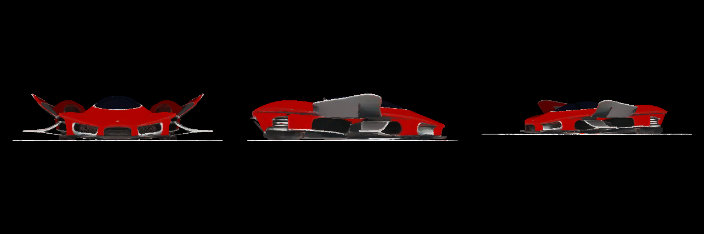

# Model pipeline (M2)

Every model the city stands on is generated on this Mac by the scripts in this
directory. Nothing here runs in the game or in the gate; it is the off-line
pipeline behind M2-0. One script installs it:

```bash
bash tools/models/setup.sh
```

It installs, in order:

| Tool | How | Where | Installed size |
|---|---|---|---|
| Blender | `brew install --cask blender` | `/Applications/Blender.app` | 907 MB |
| trellis2mlx | git clone + `uv venv` (Python 3.11) + `uv pip install -e .` | `$HOME/urbis-models/trellis2mlx` | 825 MB |
| TRELLIS.2-4B weights | `hf download` | `~/.cache/huggingface` | 15 GB |
| TRELLIS-image-large weights | `hf download` | `~/.cache/huggingface` | 3.1 GB |
| MPFB 2.0.17 | Blender extension platform | Blender's user extensions | 83 MB |

The script is idempotent: re-run it to finish or repair a step. `URBIS_MODELS_DIR`
overrides the install root. **DINOv3 is a gated Hugging Face repo** — request access
at <https://huggingface.co/facebook/dinov3-vitl16-pretrain-lvd1689m>, then
`$HOME/urbis-models/trellis2mlx/.venv/bin/hf auth login`, then re-run. Until then
the script installs everything else and names the missing repo.

## Measured

Recorded by `setup.sh` on the operator's Mac (Apple M3, 16 GB, macOS 26.6.2),
2026-10-06. Free disk is `df -Pk /`, before and after the whole install:

| | Free disk on `/` |
|---|---|
| Before | 68.5 GB |
| After | 46.9 GB |
| Used | 21.6 GB |

Versions: Blender 5.2.2 LTS · trellis2mlx `cddaf3c` · MLX 0.32.3 · Python 3.11.15 · MPFB 2.0.17.

**The weights are 18.1 GB, not the ~5 GB `ROADMAP.md` estimated** (TRELLIS.2-4B alone
is 15 GB). With Blender and the environment the pipeline needs about 22 GB of disk;
the "16 GB free" machine the roadmap planned around could not have held it. DINOv3 is
gated and not yet downloaded — M2.T3 needs the access request above before its
image-conditioned car run.

## Per-model cost (M2-0)

Peak memory is `/usr/bin/time -l`'s maximum resident set size, measured on the
operator's Mac (Apple M3, 16 GB, macOS 26.6.2), 2026-10-07.

| Model | Script | Wall | Peak RSS | Output |
|---|---|---|---|---|
| Person | `make_person.py` (Blender 5.2.2 + MPFB 2.0.17) | 31.3 s | 278 MB | 398 KB GLB, 4,752 verts / 9,500 tris, 1.0 s `Walk` |

The person is an MPFB body on its `cmu_mb` game rig. The walk is CMU mocap trial
`08_01` (cgspeed MotionBuilder-friendly BVH), vendored at
`tools/models/mocap/cmu-08_01-walk.bvh` — CMU's database is free for all uses.
The script retargets one full gait cycle, grounds each frame, decimates under
the 10,000-triangle budget and vertex-colours the body, then exports
`public/assets/models/person.glb` (M2.F2). `PERSON_OUT=<path> python3
tools/models/make_person.py` writes elsewhere; it stops and names the missing
tool if Blender or MPFB is not installed.

## M2.E1 — trellis.cpp (GGML/Metal) evaluation

Run on the operator's Mac (Apple M3, 16 GB, macOS 26.6.2), 2026-10-06, by
`tools/models/trellis_cpp.sh`; raw logs in `tools/models/evidence/`. This is an
off-line evaluation only: no game code changed, and the trellis2mlx install and
`~/.cache/huggingface` were left untouched.

**Build.** From source, no prebuilt Mac binary:
`cmake -B build -G Ninja -DCMAKE_BUILD_TYPE=Release; cmake --build build -j` in
`$HOME/urbis-models/trellis.cpp` (Metal is automatic on macOS). The ggml
submodule (`github.com/pwilkin/ggml`, branch `trellis`) must be initialised or
configure fails; the script does `git submodule update --init --recursive`.
Versions: trellis.cpp `c0bed38` · ggml `f8697b33` · ggml 0.24.0. Build output
**46 MB**. Backends: Metal + Accelerate/BLAS + CPU.

**Weights.** `hf download ilintar/trellis2-gguf --include 'q8/*.gguf'` into
`$HOME/urbis-models/trellis2-gguf` (outside the repo): **9.3 GB**, 10 files,
ungated — DINOv3 comes from this mirror, so nothing waits on a Hugging Face
access request. `birefnet.gguf` is fetched but never run: the reference is
pre-cut RGBA, so auto background removal keeps its alpha (the issues-41/35/26/34
matcher path never executes).

**Reference.** The requested pre-cut RGBA car. A search of Wikimedia Commons and
Openverse turned up no trademark-free CC0 car *photo* with a usable silhouette:
the CC0 photo cut-outs there are branded (VW, Mazda, Smart, Pontiac…) and the
unbranded CC0 cut-outs are flat cartoon clip-art. The run therefore uses
trellis.cpp's own showcase source — an AI-generated (Z-Image-Turbo) red concept
racer, no trademark, no copyright claim, in the MIT repo — and cuts it to RGBA
in the script (flood-fill from the border through near-white/light-grey, so
specular highlights inside the body stay opaque instead of the threshold
matte's holes):
<https://github.com/pwilkin/trellis.cpp/blob/main/assets/showcase/racer/racer.png>
→ `evidence/ref_car.png` (1024×1024, alpha covers 27.9%). Swap `REF_URL` in the
script and re-run with `TRELLIS_FORCE=1` for a different source.

**Run.** `./build/trellis-cli evidence/ref_car.png evidence/car.glb --models
$HOME/urbis-models/trellis2-gguf/q8 --res 512 --seed 42`, measured by
`/usr/bin/time -l` (`evidence/run_time.log`):

| Measure | trellis.cpp Q8, res 512, seed 42 | trellis2mlx (for comparison) |
|---|---|---|
| Wall time, one car | **994.7 s (16 min 35 s)** | ~21 min on an M2 Pro, likely more on this fanless Air |
| Peak RSS (`/usr/bin/time -l`) | **2.81 GB** (3,019,292,672 B) | 6.75 GB on an M2 Pro |
| Weights on disk | **9.3 GB** (Q8 GGUF, ungated) | 18.1 GB, DINOv3 still gated |
| Build / environment | 46 MB (C++, one binary) | 825 MB Python env + 907 MB Blender |
| GLB | 5.3 MB, 109,946 verts / 147,190 faces, 1024² atlas | not produced: gated DINOv3 blocks M2.T3 |
| Free disk on `/` before → after | 39.2 GB → 39.1 GB (Δ 0.1 GB for this run) | — |

The 9.3 GB set plus the 46 MB build is the whole new footprint (~9.6 GB if
installed fresh); the GLB itself only adds 5.3 MB. Metal reported a 12,124 MB
recommended working set for device MTL0; peak process RSS stayed at 2.81 GB.

**Three-view render** (`evidence/car_render_3view.png`, front / side /
three-quarter; `evidence/car_render_4view.png` is the upstream tool's 2×2
sheet). The task's `tools/render_glb.py` does not exist in this repo; the
renderers used are the upstream `tools/render_glb.py` from the trellis.cpp
clone and `evidence/render_3view.py`, a three-angle variant of it.



All evidence: `build.log`, `eval.log`, `run.log`, `run_time.log`,
`ref_car_src.png`, `ref_car.png`, `car.glb`, `car.ply`, `car_base.png`,
`car_render_3view.png`, `car_render_4view.png`, `render_3view.py`.

**Recommendation: switch.** trellis.cpp is the M2 pipeline going forward. It
already works end-to-end on this Mac — one car, seed 42, res 512, in 16 min
35 s at 2.81 GB peak — where trellis2mlx is still blocked on gated DINOv3 and
has never produced an image-conditioned model here. It is smaller (9.3 GB of
weights and a 46 MB native build against 18.1 GB and a software stack that
brings Blender to ~20 GB), it leaves more memory headroom on a 16 GB machine
(2.81 GB against 6.75 GB measured on a stronger M2 Pro), and it is native
Metal with no Python at runtime. The one caveat: this evaluation proves speed,
memory, disk and that the pipeline runs — it does not prove the GLB passes
M2-1's draw budget or the M2-6 toy check on the play camera; the installed
trellis2mlx should stay in place until those screenshots pass, so the operator
keeps an A/B if the Q8 output disappoints.

